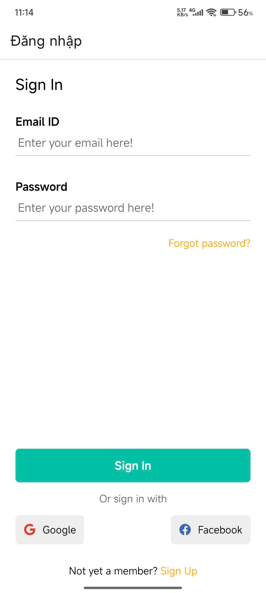
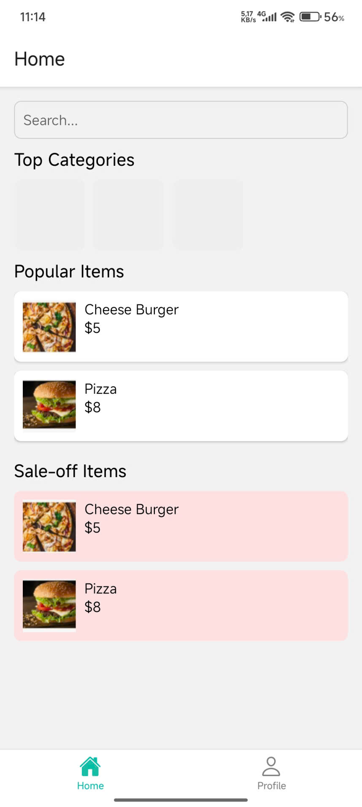
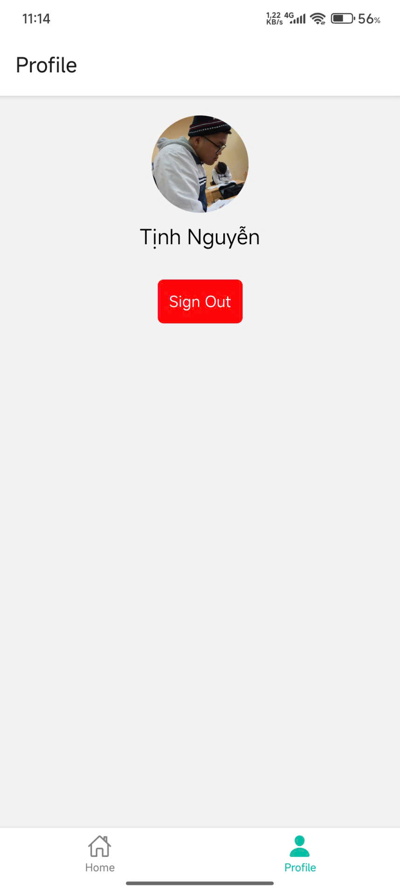

# Bài 9.1: Sử dụng Stack/Bottom Navigation + Context API - React Native

## Thông tin sinh viên
- Họ và tên: Nguyễn Thanh Tịnh 
- Mã sinh viên: 23810310439

## Mô tả
- Tiếp tục từ bài 8.1
- Hoàn thiện Login,Home,Profile Screen

## Hình ảnh kết quả chạy
### Hình ảnh LoginScreen

### Hình ảnh HomeScreen

### Hình ảnh ProfileScreen
